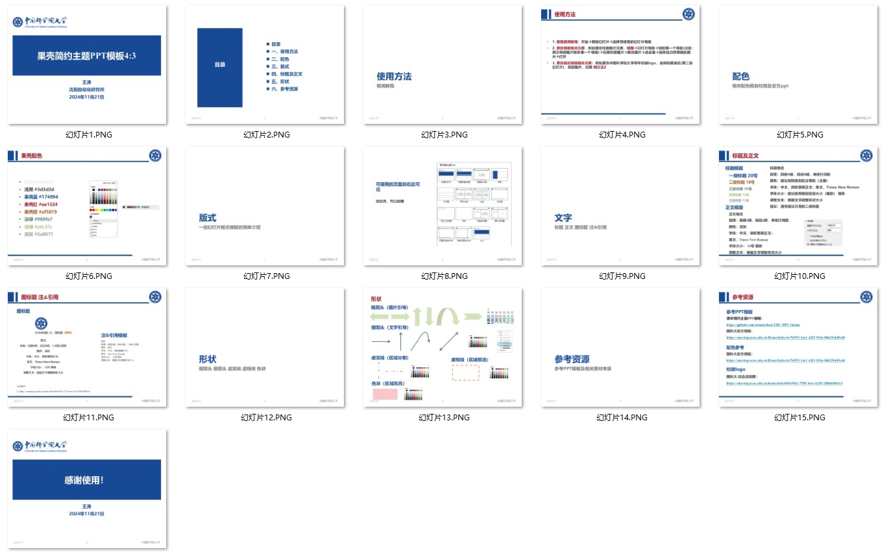

# UCAS-PPT

中国科学院大学（国科大，果壳）简约主题PPT模版

A simple theme PPT template for the University of Chinese Academy of Sciences (UCAS, Guokr)

## 前言

相信大家组会和答辩时候每次都在PPT制作耗费大量时间。本人当时做PPT找不到适合科研的模版，每次就在实验室的一张PPT模版改来改去，然后每次做PPT都得重新调整字体，制作元素等等。当时本人找了很多包括不限于国科大学校，还有各个其它学校的官方PPT模版，还有社会制作的商用PPT模版。但是学校官方的实在是太丑了，一些商用PPT各种复杂的图形又不适合工科科研使用。

最后本人找到一位清华大佬的简约PPT，https://github.com/atomiechen/THU-PPT-Theme ，感觉简约的风格比较合我意，但是这个PPT有点偏向于文科风格，最后本人决定自己做一个适合工科简约的回报和答辩PPT,于是有了这个项目。

## 内容

PPT模版为pptx格式，目前比例是4:3，未来有机会考虑出一个16:9的格式，对PPT校徽和校名作以更改，因此分为国科大和沈自所版，使用者可根据自身学校自行替换模版校徽图片。

## 更新日志

- 2025.09.03 更新 沈自所简约PPT4-3 小字版.pptx 中实验室名称

- 2024.11.21 第一版创建

## 效果

4:3比例，这里拿果壳简约主题4-3 小字版.pptx举例

## 使用说明

1. **极简使用教程**：开始->新建幻灯片->选择想使用的幻灯片母版
   
2. **更改模板相关元素**：例如更改校徽图片元素，视图->幻灯片母版->划到第一个母版(注意：其它母版图片继承第一个母版)->右键校徽图片->更改图片->此设备->选择自己想替换的图片打开
   
3. **更改版式模板相关元素**：例如更改中国科学院大学带字校徽logo，选择标题版式(第二张幻灯片)，找到图片，右键 同方法2
